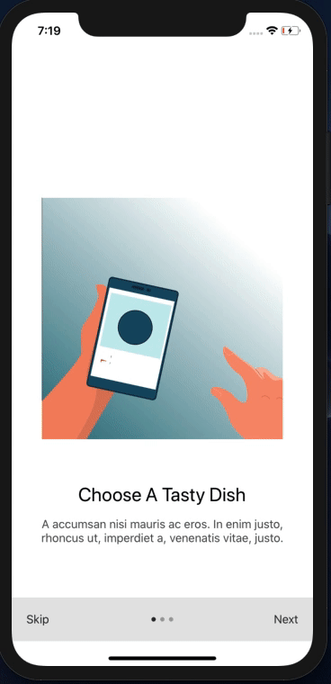

# rn-slide-intro-lottie
An Intro Slide with After Effects animation in React Native using Lottie.


<div align="center">
    <h1>Slide intro Previews </h1>
 
</div>


## Getting Started

#### 1. Clone and Install

```bash
# Clone the repo
git clone https://github.com/hppc25/rn-slide-intro-lottie.git

# Navigate to clonned folder and Install dependencies
cd rn-slide-intro-lottie && yarn install

# Install Pods
cd ios && pod install
```

#### 2. Open RNS in your iOS simulator

Run this command to start the development server and to start your app on iOS simulator:
```
react-native run:ios
```

Or, if you prefer Android:
```
react-native run:android
```

## Packages 
- [lottie-react-native](https://github.com/lottie-react-native/lottie-react-native) - Lottie is a mobile library for Android and iOS that parses Adobe After Effects animations exported as JSON with bodymovin and renders them natively on mobile!
- [react-native-onboarding-swiper](https://github.com/jfilter/react-native-onboarding-swiper) - An easy-to-use yet very configurable app introduction slider/swiper

